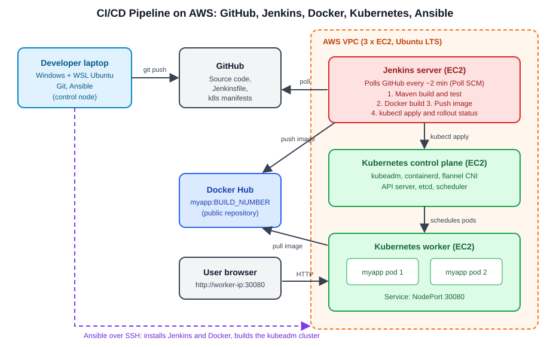
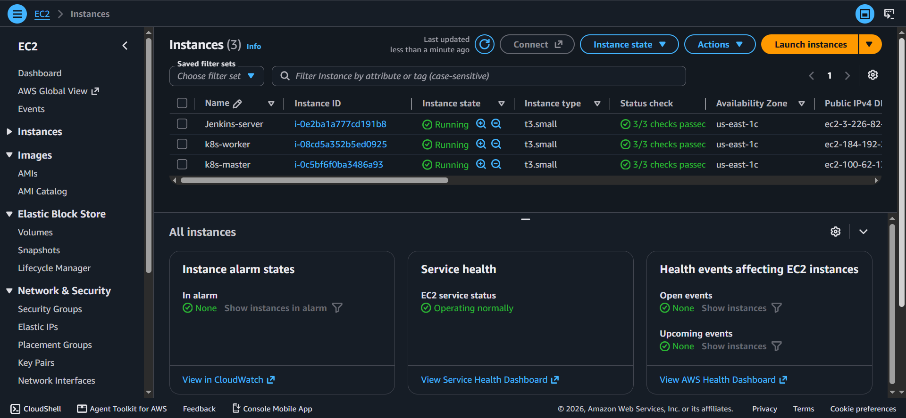
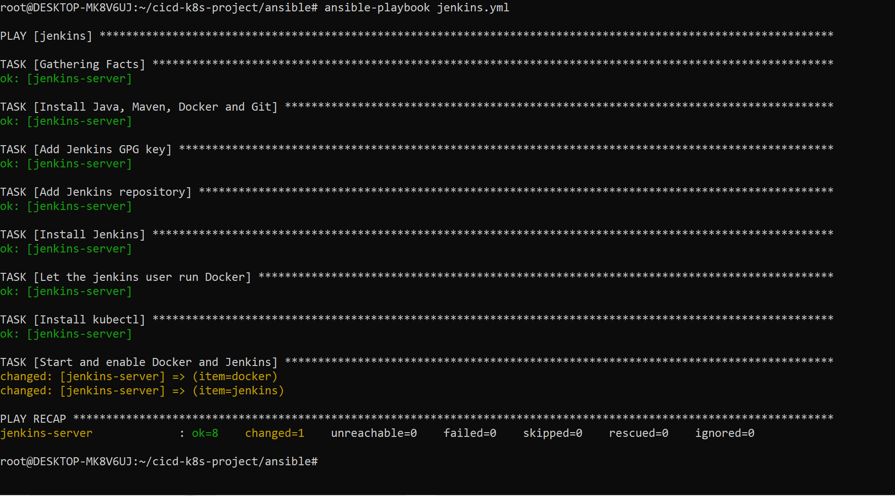
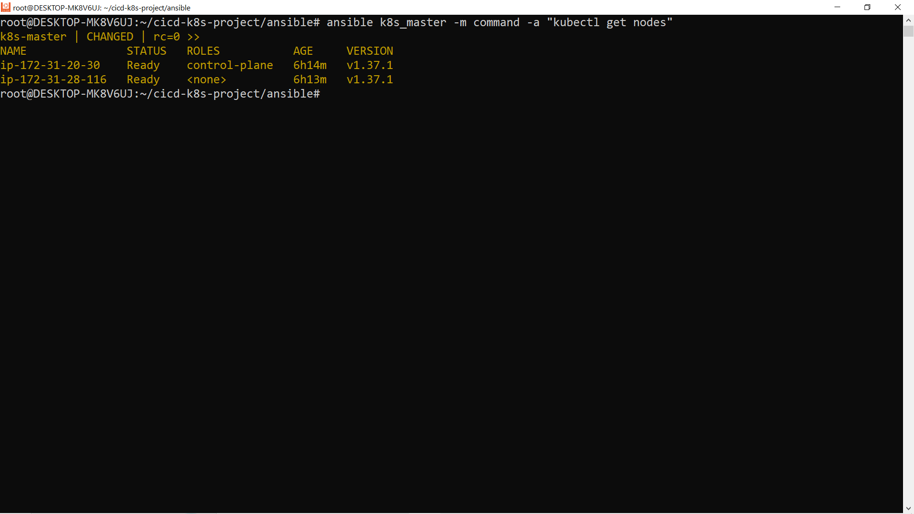
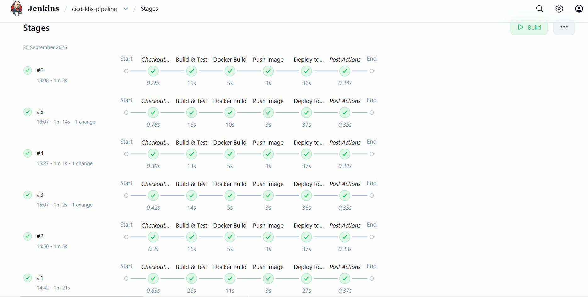
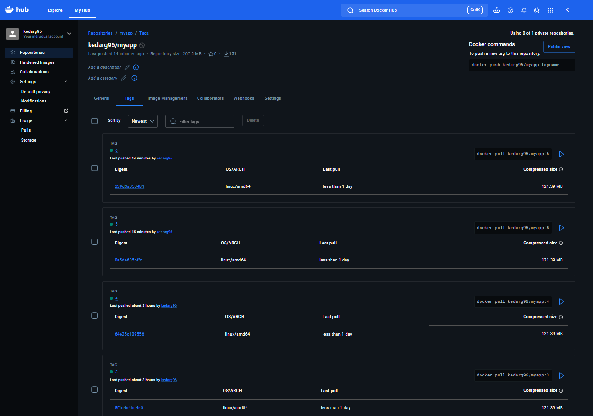
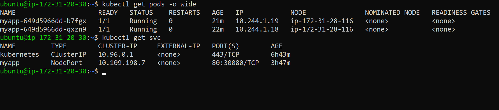
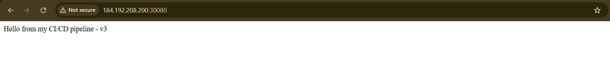
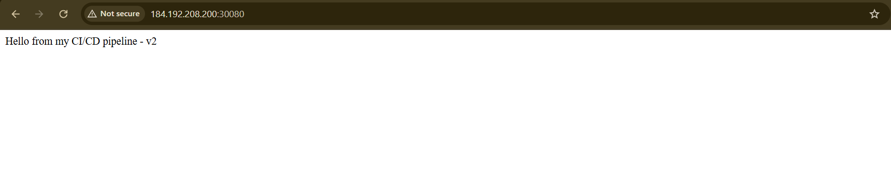
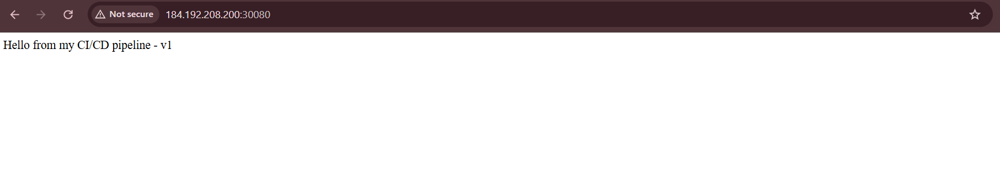

# CI/CD Pipeline on AWS: GitHub, Jenkins, Docker, Kubernetes and Ansible

An end-to-end DevOps project. Every `git push` to this repository is built and tested by Jenkins, packaged as a Docker image, pushed to Docker Hub and rolled out to a Kubernetes cluster running on AWS EC2, with no manual steps. The Jenkins server and the Kubernetes cluster themselves are provisioned and configured by Ansible playbooks.



## How it works

1. A developer pushes code to GitHub.
2. Jenkins polls the repository (about every 2 minutes) and starts the pipeline when it sees a new commit.
3. The pipeline builds and tests the Spring Boot app with Maven.
4. Jenkins builds a Docker image tagged with the build number and pushes it to Docker Hub.
5. Jenkins applies the Kubernetes manifest with `kubectl` and waits for the rollout to finish.
6. Kubernetes performs a rolling update, and the readiness probe keeps traffic on healthy pods only.

## Tech stack

| Tool | Role in this project |
|---|---|
| AWS EC2 | Three Ubuntu LTS servers: Jenkins, Kubernetes control plane, Kubernetes worker |
| Ansible | Installs Jenkins, Docker, Maven, Java and kubectl, and builds the kubeadm cluster |
| Git and GitHub | Source control for the app, manifests, playbooks and Jenkinsfile |
| Jenkins | Runs the CI/CD pipeline defined in the `Jenkinsfile` |
| Maven and Spring Boot | Builds and tests the sample Java application |
| Docker and Docker Hub | Packages the app as an image and stores versioned images |
| Kubernetes (kubeadm, containerd, flannel) | Runs the app with 2 replicas behind a NodePort service |

## Repository structure

```
cicd-k8s-project/
├── ansible/
│   ├── ansible.cfg
│   ├── inventory.ini
│   ├── jenkins.yml          # Jenkins server setup
│   └── k8s-cluster.yml      # kubeadm cluster setup
├── app/                     # Spring Boot app and Dockerfile
├── k8s/
│   └── deployment.yaml      # Deployment (2 replicas) and NodePort service
├── docs/
│   ├── architecture.svg
│   └── screenshots/
├── Jenkinsfile              # Pipeline definition
└── README.md
```

## Pipeline stages

| Stage | What it does |
|---|---|
| Build & Test | `mvn clean package` inside `app/` |
| Docker Build | Builds `kedarg96/myapp:<BUILD_NUMBER>` |
| Push Image | Logs in with a Jenkins credential and pushes to Docker Hub |
| Deploy to Kubernetes | Substitutes the image tag into the manifest, runs `kubectl apply`, then `kubectl rollout status` |

## How to reproduce

**Prerequisites:** an AWS account, a Docker Hub account with a public `myapp` repository and an access token, and a Linux shell with Ansible (WSL Ubuntu works on Windows).

1. **Create 3 EC2 instances** (Ubuntu Server LTS, at least 2 vCPUs and 2 GB RAM each, because kubeadm requires about 1.7 GB on the control plane). Use one key pair and one security group, and attach Elastic IPs.
   - Security group: SSH (22), Jenkins (8080) and the app (30080) from your IP only, plus all traffic from the group itself so the nodes can talk to each other.
2. **Fill in `ansible/inventory.ini`** with the three IP addresses and check connectivity:
   ```bash
   cd ansible
   ansible all -m ping
   ```
3. **Set up Jenkins:**
   ```bash
   ansible-playbook jenkins.yml
   ```
   Open `http://<jenkins-ip>:8080`, unlock it with the initial admin password, install the suggested plugins and create an admin user.
4. **Build the Kubernetes cluster:**
   ```bash
   ansible-galaxy collection install ansible.posix
   ansible-playbook k8s-cluster.yml
   ansible k8s_master -m command -a "kubectl get nodes"
   ```
5. **Give Jenkins cluster access:** fetch the admin kubeconfig from the control plane and place it at `/var/lib/jenkins/.kube/config` on the Jenkins server (owner `jenkins`, mode 0600).
6. **Add the Docker Hub credential** in Jenkins (Username with password, ID `dockerhub`).
7. **Create a Pipeline job** with "Pipeline script from SCM", pointing at this repository, branch `main`, script path `Jenkinsfile`, and enable **Poll SCM** with `H/2 * * * *`.
8. **Push a change.** Jenkins builds it, and the new version appears at `http://<worker-ip>:30080`.

**Rollback:**
```bash
kubectl rollout history deployment/myapp
kubectl rollout undo deployment/myapp
```

## Screenshots

### 1. EC2 instances


### 2. Ansible playbook results


### 3. Kubernetes nodes


### 4. Jenkins pipeline


### 5. Docker Hub image tags


### 6. Pods and service


### 7. Application running


### 8. Rollback
Before the rollback, the app was serving v2:



After `kubectl rollout undo deployment/myapp`, it serves v1 again:



## Problems I ran into and how I solved them

- **Jenkins repository signature error.** `apt` failed with `NO_PUBKEY` because Jenkins had rotated its package signing key. I switched the playbook to the current signing key and set `force: yes` on the download so the stale key file was replaced.
- **containerd config task failed.** The Ubuntu image I used does not create `/etc/containerd/`, so writing the default config failed. I made the task create the directory first.
- **`kubeadm init` failed preflight checks.** The control plane had 908 MB of RAM against a 1700 MB minimum. I resized the instances instead of ignoring the check, since an undersized control plane is unstable.
- **Docker permissions in Jenkins.** Builds need the `jenkins` user in the `docker` group, which the playbook now handles.
- **A commit that did not trigger a build.** The edit changed nothing, so there was no new commit to detect. I learned to check the Git Polling Log and `git log origin/main` when debugging triggers.
- **Set up Ansible on Windows.** Ansible needs Linux, so I used WSL and fixed a WSL1/WSL2 issue that broke package installs.

## Design decisions

- **Polling instead of a webhook.** Poll SCM keeps Jenkins private, because GitHub never needs to reach port 8080. A webhook would be faster but requires exposing Jenkins.
- **Image tags use the build number.** Every build is uniquely versioned, which makes rollbacks meaningful.
- **Readiness probe and `rollout status`.** A deployment only counts as successful when the new pods are healthy, so a bad build fails the pipeline.

## Possible improvements

- Provision the AWS infrastructure with Terraform
- Add a Trivy image scan stage
- Switch from polling to a GitHub webhook behind HTTPS
- Add Prometheus and Grafana for monitoring
- Move to GitOps with Argo CD

## Author

Kedar Gokhale
